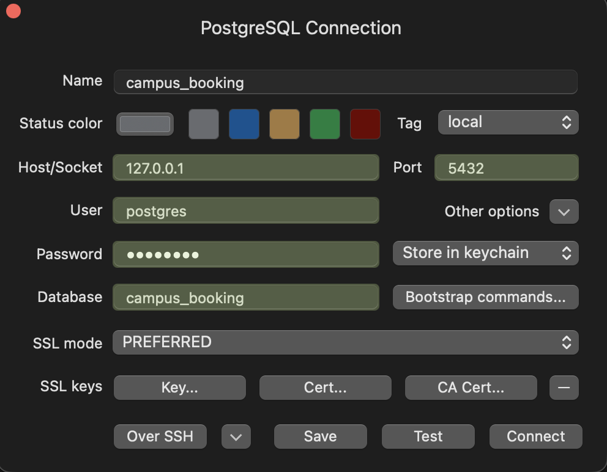

# Campus Facility Booking System

A final-year DBMS project built with **PostgreSQL + FastAPI + raw SQL + Vanilla JS**.

Students, faculty, and organizations can log in, browse available time slots for campus facilities (seminar halls, labs, sports courts, guest rooms), pay from a wallet, and make bookings. The database enforces all correctness guarantees — ACID transactions, triggers, CHECK constraints, and partial UNIQUE indexes.

---

## Tech Stack

| Layer    | Technology                          |
|----------|-------------------------------------|
| Backend  | Python 3.10+, FastAPI, psycopg2     |
| Database | PostgreSQL 16                       |
| Frontend | Vanilla HTML/CSS/JS (single page)   |

---

## Prerequisites

Install these before starting:

- **Python 3.10+** — [python.org/downloads](https://www.python.org/downloads/)
- **PostgreSQL 16** — [postgresql.org/download](https://www.postgresql.org/download/)

> **Important:** This app connects to PostgreSQL using the credentials below.
> Make sure you use exactly these when installing or creating your PostgreSQL user:
>
> | Setting  | Value            |
> |----------|------------------|
> | User     | `postgres`       |
> | Password | `postgres`       |
> | Database | `campus_booking` |
> | Host     | `localhost`      |
> | Port     | `5432`           |

---

### Installing PostgreSQL

**Mac (Homebrew):**
```bash
brew install postgresql@16 python@3.12
brew services start postgresql@16
echo 'export PATH="/opt/homebrew/opt/postgresql@16/bin:$PATH"' >> ~/.zprofile
source ~/.zprofile
```

Homebrew does not create a `postgres` user by default. Run this once after installing:
```bash
psql postgres -c "CREATE ROLE postgres WITH SUPERUSER LOGIN PASSWORD 'postgres';"
```

---

**Windows:**

During the PostgreSQL installer, you will be asked to set a password for the `postgres` user.
**Set it to `postgres`** so it matches the app's default config.

After installing, add PostgreSQL to your PATH so `psql` and `createdb` work from any terminal:

1. Open **Start** → search **"Environment Variables"** → click **"Edit the system environment variables"**
2. Click **"Environment Variables"** → under **System variables**, find and select **Path** → click **Edit**
3. Click **New** and add:
   ```
   C:\Program Files\PostgreSQL\16\bin
   ```
4. Click **OK** on all dialogs to save
5. **Close and reopen** your terminal for the change to take effect
6. Verify it works:
   ```bash
   psql --version
   ```

---

**Linux (Ubuntu/Debian):**
```bash
sudo apt install postgresql python3 python3-pip python3-venv
sudo systemctl start postgresql
```

Set the password for the `postgres` user to match the app:
```bash
sudo -u postgres psql -c "ALTER USER postgres PASSWORD 'postgres';"
```

PostgreSQL binaries on Ubuntu/Debian live under `/usr/lib/postgresql/16/bin/`. Add them to your PATH so `psql` and `createdb` work from any terminal:

```bash
echo 'export PATH="/usr/lib/postgresql/16/bin:$PATH"' >> ~/.bashrc
source ~/.bashrc
```

Verify it works:
```bash
psql --version
python3 --version
```

---

## Setup (step by step)

### 1. Clone the repo

```bash
git clone https://github.com/be-water22/facility-booking.git
```

### 2. Navigate into the project folder

```bash
cd facility-booking
```

All commands below assume you're inside the `facility-booking/` directory.

### 3. Create a virtual environment and install dependencies

```bash
python3 -m venv venv

# Mac/Linux
source venv/bin/activate

# Windows
venv\Scripts\activate

pip install -r requirements.txt
```

### 4. Create the database and apply the schema

```bash
createdb -U postgres campus_booking
psql -U postgres campus_booking < schema.sql
```

Enter the password `postgres` when prompted. You should see a list of `CREATE TABLE`, `CREATE TRIGGER`, `CREATE INDEX` messages — that means the schema was applied successfully.

### 5. Seed the database

> **Note:** Only run this once. Running it again will wipe all existing data and start fresh.

```bash
python seed.py
```

This creates:
- 50 users (30 students, 8 faculty, 2 admins, 10 organizations)
- 15 facilities across all types
- Time slots for each facility
- A few sample bookings

It also writes a `credentials.txt` file in the project folder with every user's email and password.

### 6. Start the server

```bash
uvicorn main:app --reload
```

Open **http://localhost:8000** in your browser — the UI will load.

Swagger API docs are at **http://localhost:8000/docs**

---

## Viewing the Database (TablePlus)

TablePlus is a free GUI tool to browse and query your PostgreSQL database visually.

**Install:**
```bash
# Mac
brew install --cask tableplus
```
Windows: download from [tableplus.com](https://tableplus.com)

**Connect using these exact settings:**



Click **Test** to verify the connection, then **Connect**.

---

## Logging in

After seeding, open `credentials.txt` to find login credentials. Some quick examples:

| Role         | Email                         | Password     |
|--------------|-------------------------------|--------------|
| Admin        | `admin1@iitk.ac.in`           | see file     |
| Admin        | `admin2@iitk.ac.in`           | see file     |
| Student      | any `@iitk.ac.in` entry       | see file     |
| Organization | `antaragni@orgs.iitk.ac.in`   | see file     |

Password format is always: **4 lowercase letters + 4 digits** (e.g. `abcd1234`)

---

## Project Structure

```
facility-booking/
├── schema.sql          # 9 tables, 2 triggers, 5 indexes — the entire DB schema
├── seed.py             # Fills the DB with sample data (run once)
├── main.py             # FastAPI backend — all API endpoints
├── static/
│   └── index.html      # Frontend — single page app (no framework)
├── tests/              # Automated pytest test suite
│   ├── conftest.py
│   ├── bots.py
│   ├── test_concurrency_booking.py
│   ├── test_concurrency_wallet.py
│   ├── test_constraints.py
│   └── test_rollback.py
├── images/
│   └── tableplus-connection.png   # TablePlus setup screenshot
├── TESTING.md          # Step-by-step manual testing guide
└── requirements.txt
```

---

## Running Tests

Make sure the server is running (`uvicorn main:app --reload`) in one terminal, then in another:

```bash
pytest -v tests/
```

For details on every test — concurrency races, ACID guarantees, trigger checks, rollback paths, and the DB constraints they exercise — see [TESTING.md](TESTING.md).

---

## Common Errors

| Error | Fix |
|-------|-----|
| `role "postgres" does not exist` | Run: `psql postgres -c "CREATE ROLE postgres WITH SUPERUSER LOGIN PASSWORD 'postgres';"` |
| `psql: command not found` (Windows) | Add `C:\Program Files\PostgreSQL\16\bin` to your System PATH (see Installing PostgreSQL above) |
| `connection refused on port 5432` | PostgreSQL is not running. Run: `brew services start postgresql@16` (Mac) or `sudo systemctl start postgresql` (Linux) |
| `credentials.txt not found` when running tests | Run `python seed.py` first |
| `API not reachable` in tests | Start the server: `uvicorn main:app --reload` |
| `ModuleNotFoundError` | Make sure your virtual environment is activated: `source venv/bin/activate` |
